# vue-cli

vue-cli 是 Vue.js 开发的标准工具。它简化了程序员基于 webpack 创建工程化的 Vue 项目的过程。


https://cli.vuejs.org/zh/


vue-cli 是 npm 上的一个全局包，使用 npm install 命令，即可方便的把它安装到自己的电脑上：

`npm install -g @vue/cli`


基于 vue-cli 快速生成工程化的 Vue 项目：

`vue create 项目的名称`


**4. vue 项目的运行流程**

在工程化的项目中，vue 要做的事情很单纯：通过 main.js 把 App.vue 渲染到 index.html 的指定区域中。

其中：

① App.vue 用来编写待渲染的模板结构

② index.html 中需要预留一个 el 区域

③ main.js 把 App.vue 渲染到了 index.html 所预留的区域中


}).$mount('#app') 和 使用 el: "#app"作用完全一样


# **vue 组件**

组件化开发指的是：根据封装的思想，把页面上可重用的 UI 结构封装为组件，从而方便项目的开发和维护


vue 是一个支持组件化开发的前端框架。

vue 中规定：组件的后缀名是 .vue。之前接触到的 App.vue 文件本质上就是一个 vue 的组件。


**3. vue 组件的三个组成部分**

每个 .vue 组件都由 3 部分构成，分别是：

- template -> 组件的模板结构

- script -> 组件的 JavaScript 行为

- style -> 组件的样式

其中，每个组件中必须包含 template 模板结构，而 script 行为和 style 样式是可选的组成部分。

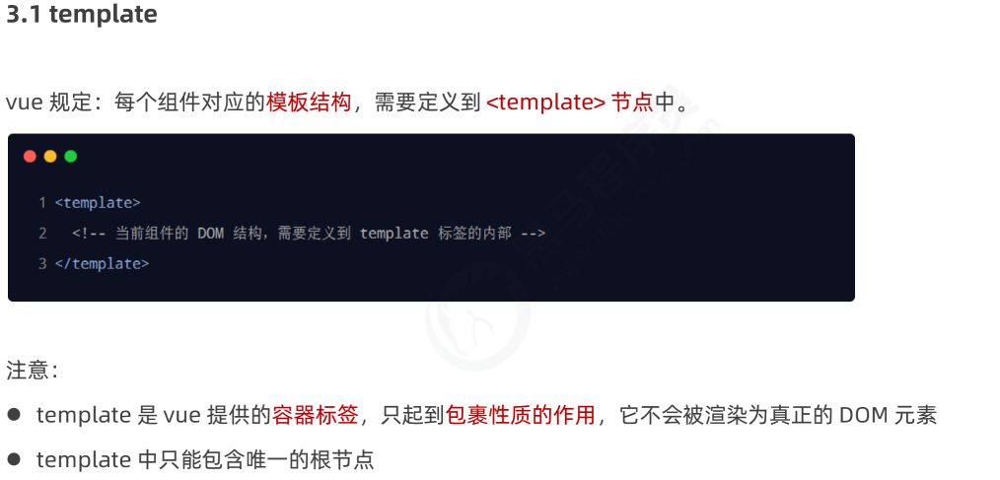


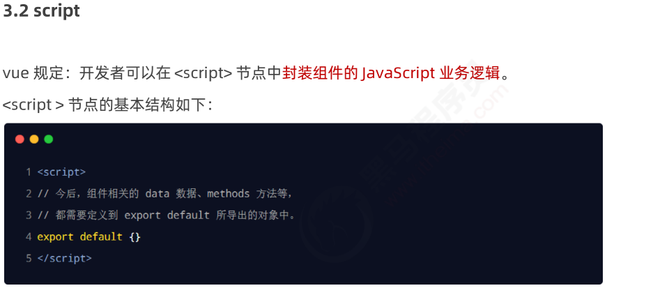

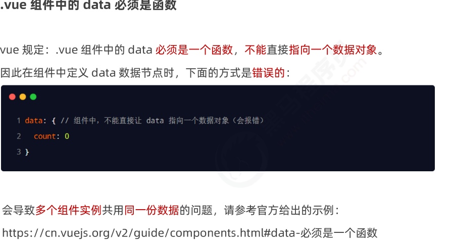

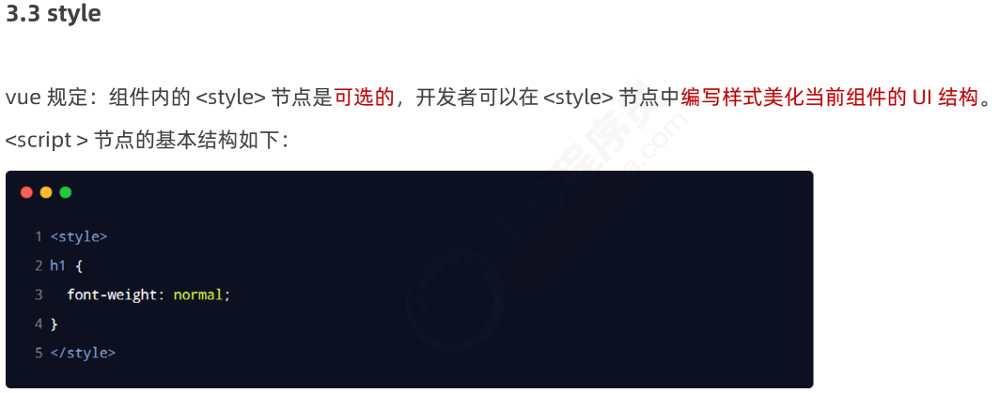


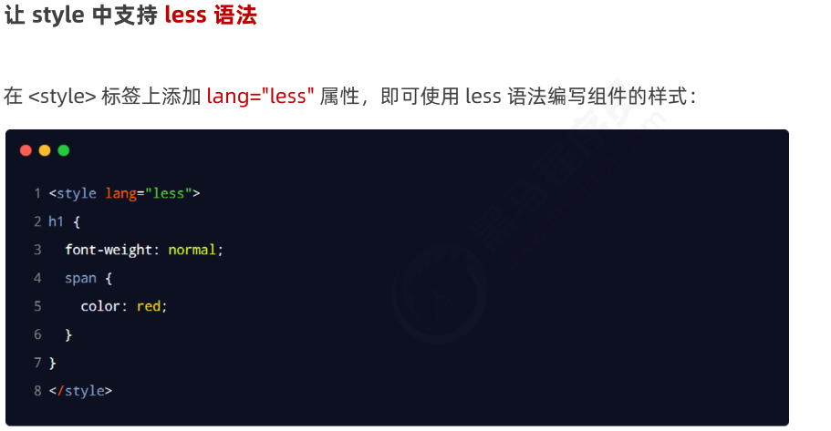


```js
export default {
  //data数据源
  //注意： 。vue 组件中的data 不能像之前一样，不能指向对象
  //注意： 组件中的 data 必须是一个函数
  data(){
    //这个 return 出去的{}中，可以定义数据
    return{
      username: 'admin'
    }
  },
  methods: {
    changeName(){
      //在组件岁 this 表示当前组件的 实例对象
      this.username = 'zs'
    }
  },
  // 当前组件中的监听器
  watch: {},
  // 当前组件中的计算属性
  computed: {},
  // 当前组件中的过滤器
  filters: {}
}
```


模板结构中只能有一个根元素

```html
  <div id="app">
     <h3>这里是用户自定义的 -------{{ username }}</h3>
    <button @click="changeName">修改用户名</button>
    
    <HelloWorld msg="Welcome to Your Vue.js App"/>
  </div>
```

如果想使用less语法需要声明

```less
<style lang="less">
#app {
  font-family: Avenir, Helvetica, Arial, sans-serif;
  -webkit-font-smoothing: antialiased;
  -moz-osx-font-smoothing: grayscale;
  text-align: center;
  color: #2c3e50;
  margin-top: 60px;
}
```


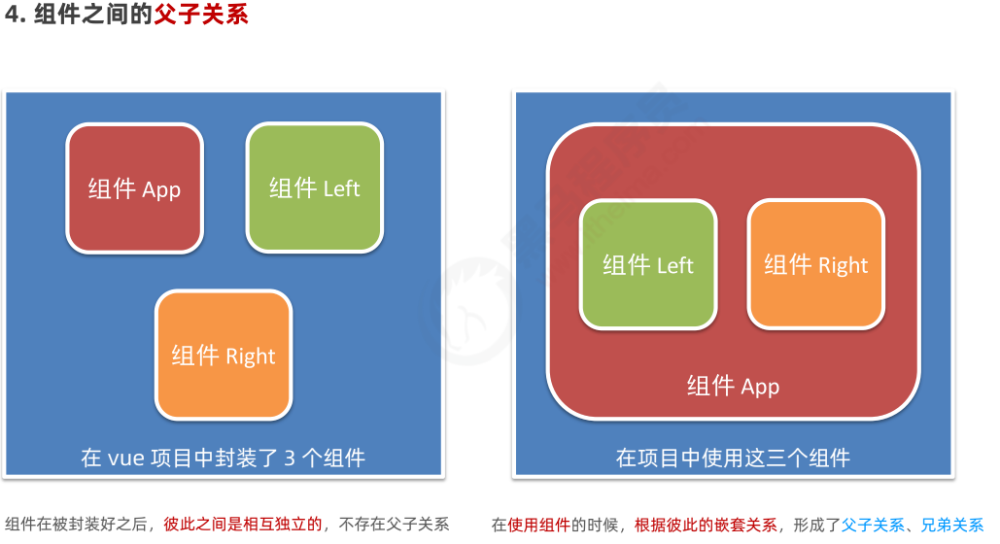


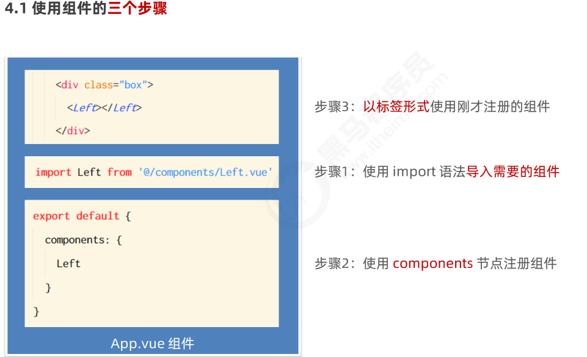


```vue
<template>
  <div class="app-container">
    <h1>App 根组件</h1>
    <hr />

  
    <div class="box">
      <!-- 渲染 Left 组件和 Right 组件 -->
      <Left></Left>
      <Right></Right>
      
    </div>
  </div>
</template>

<script>
import Right from '@/components/Right.vue'
import Left from '@/components/Left.vue'

export default {
  components: {
    //"Left" : Left
    Left,
    Right
  }
}
</script>
```


注意： 

配置路径时提示问题

可以安装Path Autocomplete

并在配置文件中添加配置

```json
{
    //导入文件时是否携带文件的扩展名
    "path-autocomplete.extensionOnImport": true,
    //配置@ 的路径提示
    "path-autocomplete.pathMappings": {
        "@": "${folder}/src"
    },
```

也有人说可以用 path intelligence


标签自动闭合问题

auto close tag插件


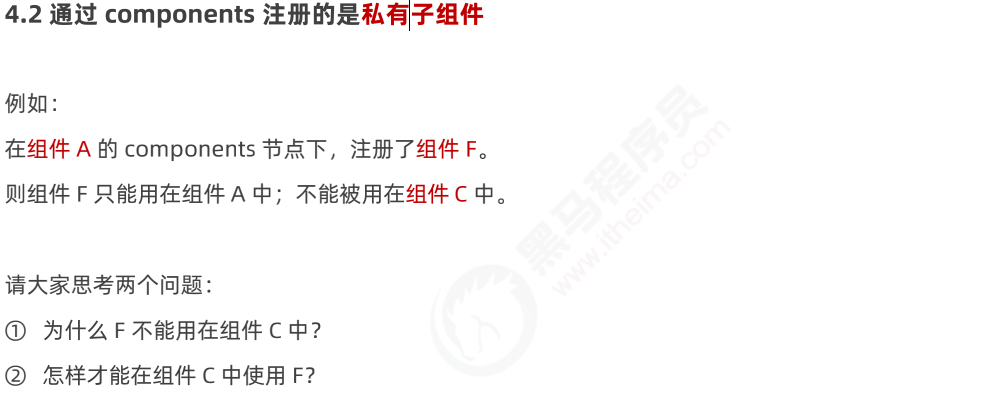


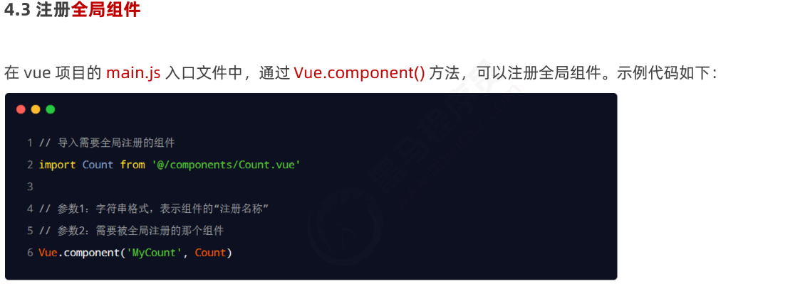


props

案例准备

```vue
<template>
    <div>
        <h5>Count 组件</h5>
        <p>count 的值是 ： {{ count }}</p>
        <button @click = "add">+1</button>
    </div>
</template>

<script>
export default {
    data(){
        return {
            count: 0
        }
    },
    methods: {
        add() {
            this.count += 1
        }
    }
}
</script>
```

当方法中只有一行的时候，可以简写`<button @click = "count += 1">+1</button>`

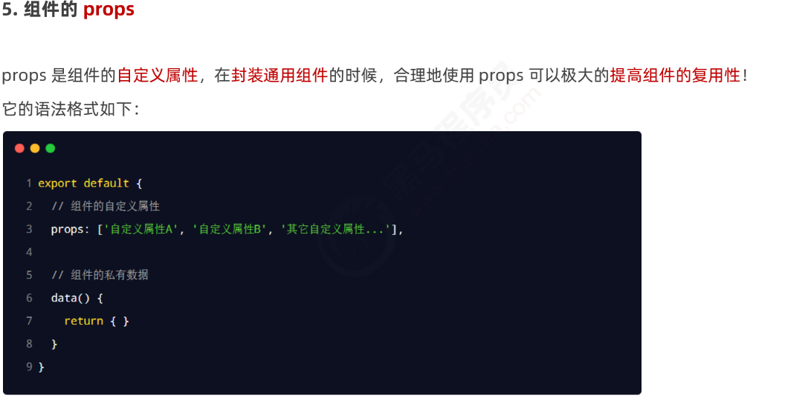

count组件

```vue
<template>
    <div>
        <h5>Count 组件</h5>
        <p>count 的值是 ： {{ init }}</p>
        <button @click = "count += 1">+1</button>
    </div>
</template>

<script>
export default {
    //props 是自定义属性，允许使用者通过自定义属性，为当前组件指定初始值
    props:["init"],
    data(){
        return {
            count: 0
        }
    }
}
</script>
```

Left.vue

`<MyCount init="9"></MyCount>`

Right.vue

`<MyCount init="6"></MyCount>`

注意： 使用`v-bind:init='6'`时，由于`v-bind`中的是js代码，所以传递过去的是数字，否则传递过去的是字符串


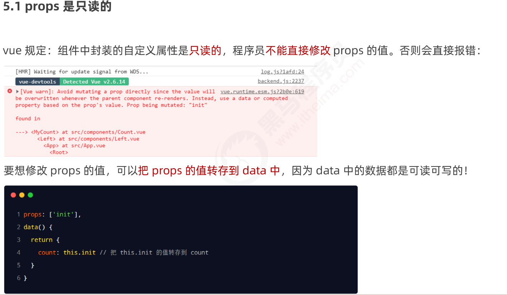


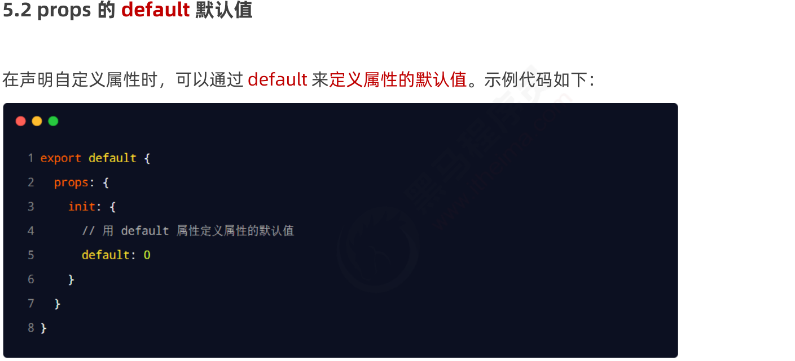


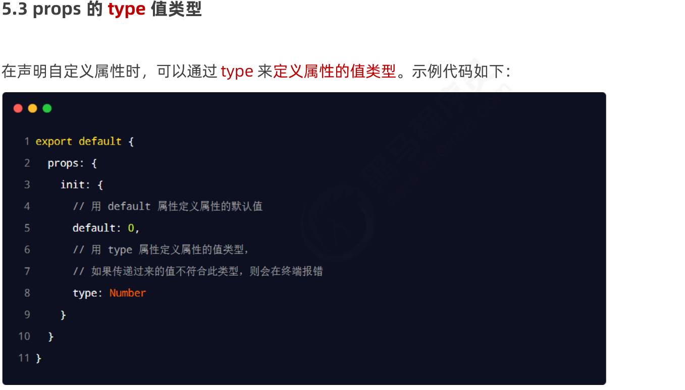


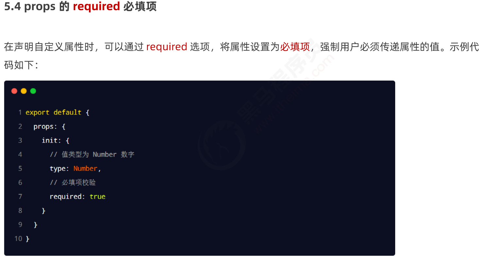


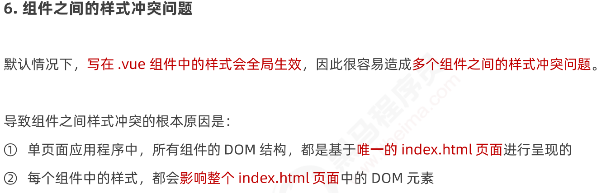


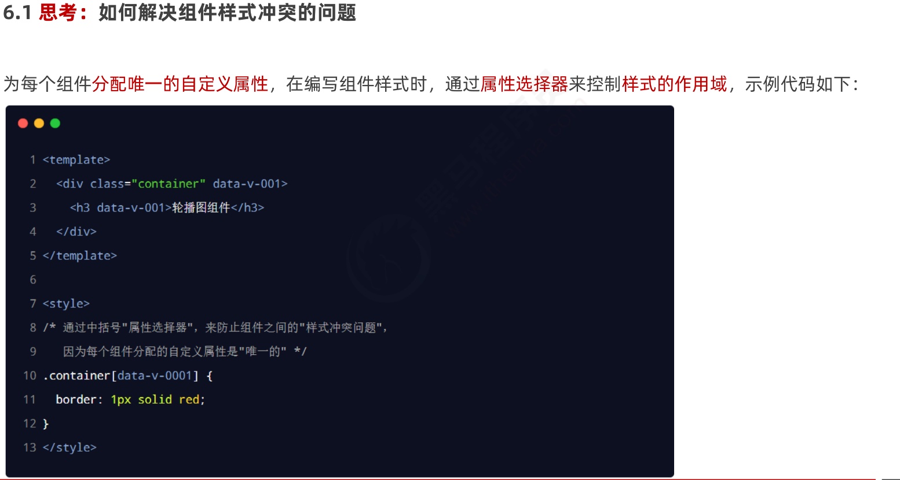

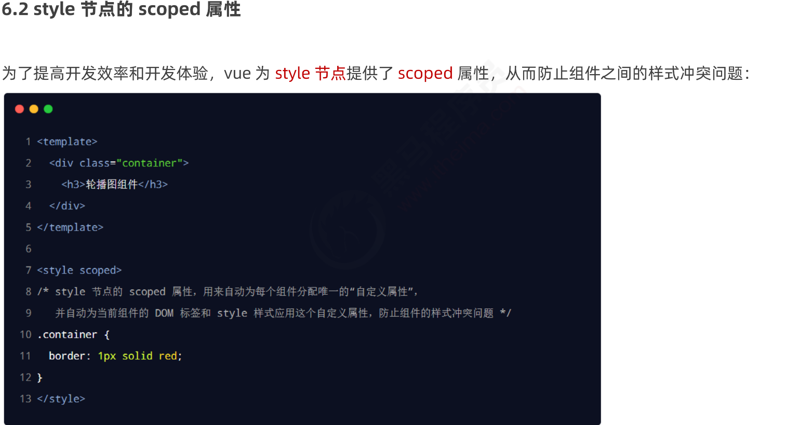


#### 父组件中改造子组件的样式时，当使用第三方组件库时，有需要修改组件样式的时候

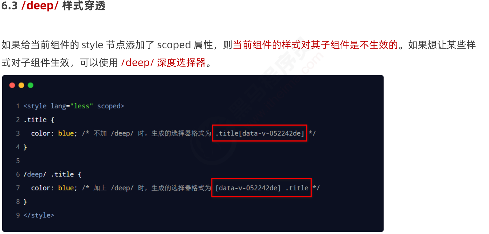


## 组件生命周期

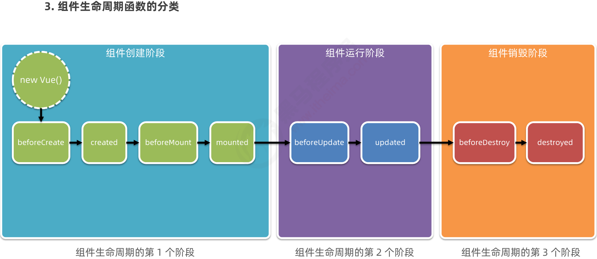

可以参考 vue 官方文档给出的“生命周期图示”，进一步理解组件生命周期执行的过程：

https://cn.vuejs.org/v2/guide/instance.html#生命周期图示


created

```vue
<template>
  <div class="test-container">
    <h3>Test.vue 组件 --- {{ books.length }}</h3>
  </div>
</template>

<script>
export default {
  props: ["info"],
  data() {
    return {
      message: "hello vue.js",
      books: [],
    };
  },
  methods: {
    show() {
      console.log("show被使用了");
    },
    initBookList() {
      const xhr = new XMLHttpRequest();
      xhr.addEventListener("load", () => {
        console.log("this is resoonse string" + xhr.responseText); //接收到的是字符串
        const result = JSON.parse(xhr.responseText);
        console.log(result);
        this.books = result.data;
      });
      xhr.open("GET", "http://www.liulongbin.top:3006/api/getbooks");
      xhr.send();
    },
  },

  beforeCreate() {
    //不可用的状态
  },
  //第二个生命周期函数: 数据可用，模板不可用
  //实际开发中会发起Ajax请求获取数据
  created() {
    console.log(this.message);
    this.show();
    this.initBookList();
  },
};
</script>

<style lang="less" scoped>
.test-container {
  background-color: pink;
  height: 200px;
}
</style>
```


## 组件之间的数据共享

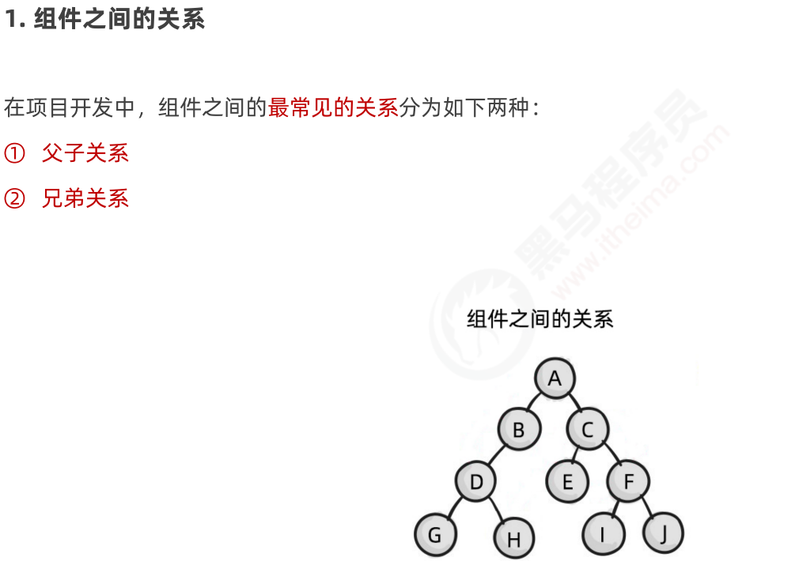


### 父 --->  子：自定义属性

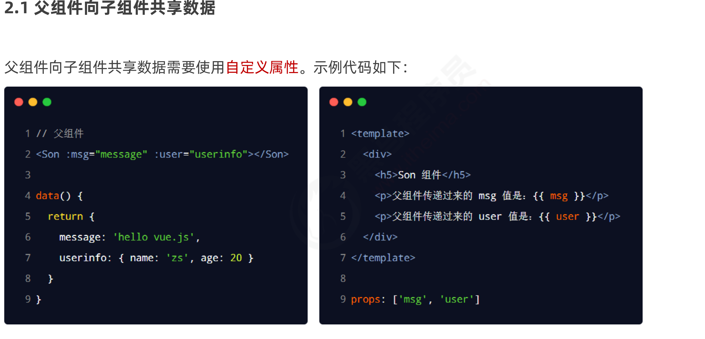

### 子 ---> 父：自定义事件

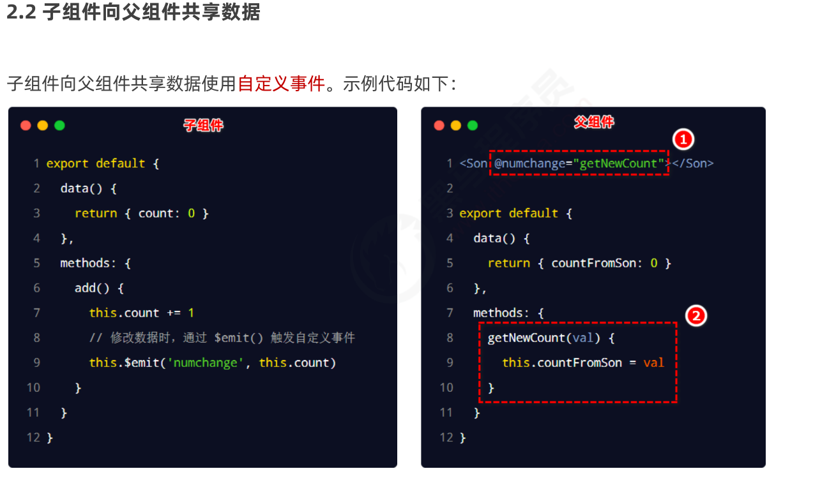

### 兄弟：EventBus

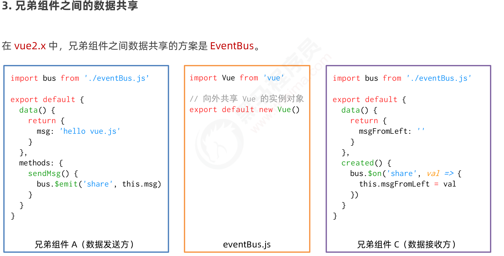

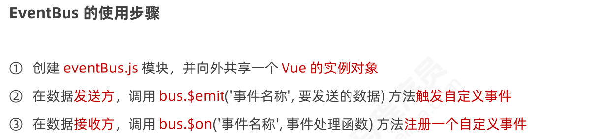


